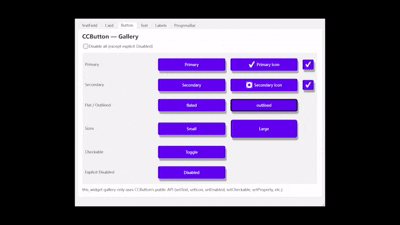
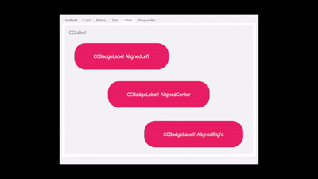
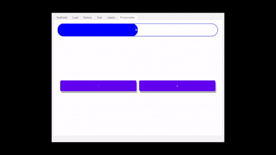
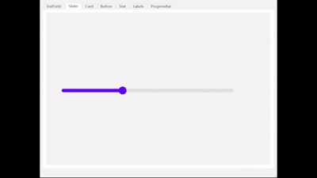
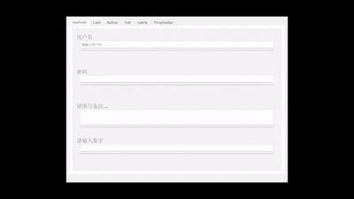

# QMaterialCraft 

[](https://www.qt.io/)[](https://isocpp.org/)[](https://github.com/Charliechen114514/QMaterialCraft)[](LICENSE) [](#) [](#)

> QMaterialCraft — 一套基于 **Qt6 + C++17** 的现代 Material Design 风格桌面控件库。  
> 目标：为 Qt 桌面应用提供一致、可定制且美观的 Material 风格原语，所有的控件尽力高度兼容Native Widget的功能使用。

---

## 📦 已完成控件列表

| 控件名称        | 完成时间         | Material 对应概念                               | Animation                           |
| --------------- | ---------------- | ----------------------------------------------- | ----------------------------------- |
| `CCButton`      | 2025/10/30 23:20 | Material 按钮（包含点击、hover、ripple 动画）   |       |
| `CCCards`       | 2025/10/31 17:40 | Material 卡片（Card Layout、阴影、分组容器）    |         |
| `CCLabel`       | 2025/10/31 15:03 | Material 文本标签（支持字体、颜色、动画提示）   |        |
| `CCProgressBar` | 2025/10/31 18:33 | Material 进度条（线性/循环进度、状态动画）      |  |
| `CCSlider`      | 2025/10/31 15:03 | Material 滑块（拖动、轨道、轨迹动画）           |       |
| `CCTextField`   | 2025/11/01 11:13 | Material 输入框（浮动标签、错误提示、清除按钮） |    |


## 🚀🛠 构建 & 运行

这个是一个经典的CMake组织项目，您无需额外做任何事情，以及截止至目前，只有Qt简单的第三方依赖。如果您想亲自在您的计算机上尝试，您需要按照如下步骤。确保系统中已安装 **Qt6 (含 Widgets 模块)**，然后按以下步骤执行：

> Qt-Creator Build

```
git clone https://github.com/Charliechen114514/QMaterialCraft
```

​	只需要打开克隆的仓库作为QtCreator的项目然后选择构建即可。

> Non-Qt-Creator

```bash
# 1. 克隆仓库
git clone https://github.com/Charliechen114514/QMaterialCraft
cd QMaterialCraft

# 2. 创建构建目录
mkdir build && cd build

# 3. 生成构建文件
cmake .. -DCMAKE_PREFIX_PATH="/path/to/qt6/gcc_64" \
         -DCMAKE_BUILD_TYPE=Release

# 4. 编译项目
cmake --build . -j

# 5. 运行示例（可选）
./demo
```

## Todos

- [ ] 完成进一步控件的API文档
- [ ] 添加更多有趣的控件（Todo: 想几个先）
